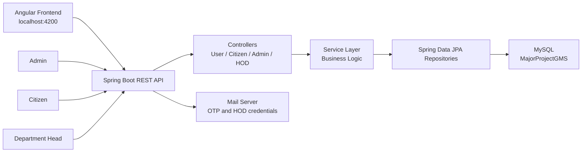
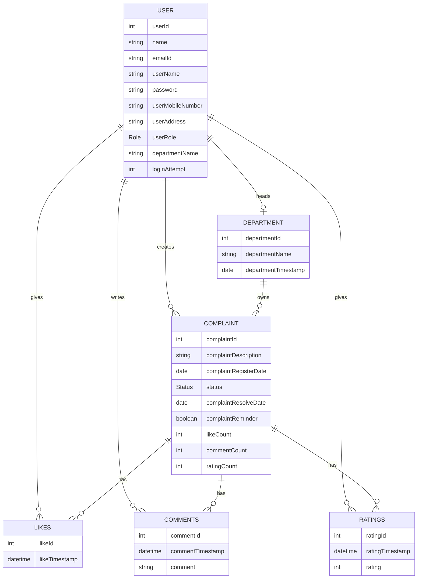

# SpringBoot_Backend_GMS

SpringBoot_Backend_GMS is a Spring Boot backend for a Grievance Management System (GMS). It exposes REST APIs for citizens, department heads (HODs), admins, complaints, departments, likes, comments, ratings, login, OTP email, and account unlock workflows.

The backend is designed to work with an Angular frontend running at `http://localhost:4200` and a MySQL database named `MajorProjectGMS`.

## Tech Stack

| Area | Technology |
| --- | --- |
| Language | Java 11 |
| Framework | Spring Boot 2.6.1 |
| REST API | Spring Web |
| Persistence | Spring Data JPA, Hibernate |
| Database | MySQL |
| Mail | Spring Boot Mail, JavaMail |
| Build Tool | Maven |
| DTO Mapping Dependency | ModelMapper |
| PDF Dependency | OpenPDF |

## Project Purpose

The application helps manage civic complaints through three main roles:

- `CITIZEN`: registers, logs in, creates complaints, tracks status, reopens completed complaints, comments, likes, and rates complaints.
- `DEPARTMENT_HEAD`: views complaints assigned to their department, transfers complaints, completes complaints, and views reminder complaints.
- `ADMIN`: manages HOD users, departments, locked accounts, complaints, and complaint engagement data such as likes, comments, and ratings.

## High Level Design



## Layered Architecture

```text
src/main/java/com/cybage
|-- app
|   `-- GmsBackendApplication.java
|-- controller
|   |-- AdminController.java
|   |-- CitizenController.java
|   |-- HodController.java
|   `-- UserController.java
|-- service
|   |-- IAdminService.java / AdminServiceImpl.java
|   |-- ICitizenService.java / CitizenServiceImpl.java
|   |-- IHodService.java / HodServiceImpl.java
|   `-- IUserService.java / UserServiceImpl.java
|-- dao
|   |-- UserRepository.java
|   |-- DepartmentRepository.java
|   |-- ComplaintRepository.java
|   |-- LikeRepository.java
|   |-- CommentRepository.java
|   `-- RatingRepository.java
|-- model
|   |-- User.java
|   |-- Department.java
|   |-- Complaint.java
|   |-- Likes.java
|   |-- Comments.java
|   |-- Ratings.java
|   |-- Role.java
|   `-- Status.java
|-- dto
`-- exception
```

### Responsibilities

| Layer | Responsibility |
| --- | --- |
| `controller` | Defines REST endpoints, receives requests, sends responses, maps request data to service calls. |
| `service` | Implements business logic such as complaint creation, login attempts, likes toggle, rating update, department assignment, account unlock, and complaint transfer. |
| `dao` | Spring Data JPA repositories for database operations and custom queries. |
| `model` | JPA entities and enums used to create database tables and relationships. |
| `dto` | Request/response carrier objects for API payloads. |
| `exception` | Custom exception and global exception handling classes. |

## Core Domain Model



## Enums

### Role

- `ADMIN`
- `DEPARTMENT_HEAD`
- `CITIZEN`

### Status

- `PENDING`
- `COMPLETED`
- `REOPEN`

## Main Workflows

### Citizen Complaint Workflow

1. Citizen registers using `/citizen/registerUser`.
2. Citizen logs in using `/user/authenticateUser`.
3. Citizen creates a complaint using `/citizen/makeComplaint/{userId}/{departmentId}/{complaintDesc}`.
4. Complaint is created with `PENDING` status and assigned to a department.
5. Citizen can enable reminder, add comments, like/unlike, rate, and view status.
6. If a completed complaint needs more work, citizen can reopen it.

### HOD Complaint Workflow

1. HOD logs in with credentials created by admin.
2. HOD views complaints for their department.
3. HOD can transfer a complaint to another department.
4. HOD can mark a complaint as `COMPLETED`.
5. On completion, the resolve date is set and complaint reminder is disabled.

### Admin Management Workflow

1. Admin adds HOD users and sends credentials by email.
2. Admin creates departments and assigns HODs.
3. Admin views complaints and engagement details.
4. Admin unlocks accounts where login attempts are greater than `3`.
5. Admin manages departments and HOD records.

### Authentication and Account Locking

- Login is handled by `/user/authenticateUser`.
- The service checks username and password directly against the `user` table.
- Failed login increments `loginAttempt`.
- If `loginAttempt > 3`, login returns `403 FORBIDDEN`.
- Admin can unlock the account using `/admin/unlockAccount/{userId}`.

## API Endpoints

Base URL:

```text
http://localhost:8080
```

### User APIs

| Method | Endpoint | Purpose |
| --- | --- | --- |
| `POST` | `/user/authenticateUser` | Authenticate a user with username and password. |
| `GET` | `/user/getUserByUserName/{userName}` | Get user details by username. |
| `GET` | `/user/getUserByUserId/{userId}` | Get user details by ID. |
| `GET` | `/user/getotp/{email}` | Send OTP email and return generated OTP. |

### Citizen APIs

| Method | Endpoint | Purpose |
| --- | --- | --- |
| `POST` | `/citizen/registerUser` | Register a citizen. |
| `POST` | `/citizen/makeComplaint/{userId}/{departmentId}/{complaintDesc}` | Create a complaint. |
| `GET` | `/citizen/getAllComplaints/{userId}` | Get complaints created by a citizen. |
| `GET` | `/citizen/getAllComplaints` | Get all complaints. |
| `GET` | `/citizen/changePassword/{id}/{newPassword}` | Change citizen password. |
| `GET` | `/citizen/enableComplaintReminder/{id}` | Enable reminder for a complaint. |
| `GET` | `/citizen/reopenComplaint/{id}` | Reopen a complaint. |
| `GET` | `/citizen/getStatusById/{id}` | Get complaint status by user ID query implementation. |
| `GET` | `/citizen/changeStatusReopen/{id}` | Change completed complaint status to reopen. |
| `GET` | `/citizen/likeById/{id}/{userId}` | Toggle like/unlike for a complaint. |
| `GET` | `/citizen/likedOrNot/{complaintId}/{userId}` | Check whether user liked a complaint. |
| `GET` | `/citizen/getLikesCount/{complaintId}` | Get complaint likes count. |
| `GET` | `/citizen/getAllLikes` | Get all likes. |
| `GET` | `/citizen/getAllLikesByComplaintId/{complaintId}` | Get likes for a complaint. |
| `GET` | `/citizen/getAllComments` | Get all comments. |
| `POST` | `/citizen/addComments?complaintId=&userId=&comment=` | Add comment to a complaint. |
| `GET` | `/citizen/getCommentByComplaint/{complaintId}` | Get display comments for a complaint. |
| `POST` | `/citizen/giveRatingById?complaintId=&userId=&rating=` | Add or update complaint rating. |
| `GET` | `/citizen/getAllRatings` | Get all ratings. |
| `GET` | `/citizen/getAllRatingsByComplaintId/{complaintId}` | Get ratings for a complaint. |

### Admin APIs

| Method | Endpoint | Purpose |
| --- | --- | --- |
| `GET` | `/admin/getAllComplaints` | Get all complaints. |
| `POST` | `/admin/addHod` | Add HOD user and send credentials by email. |
| `DELETE` | `/admin/removeHod/{id}` | Remove HOD user. |
| `GET` | `/admin/getHod/{id}` | Get HOD by user ID. |
| `GET` | `/admin/getHodByDepartmentName/{departmentName}` | Get HOD by department name. |
| `PUT` | `/admin/editHod` | Edit HOD details. |
| `GET` | `/admin/getAllHod` | Get all HOD users. |
| `GET` | `/admin/getAvailableHod` | Get HOD users not assigned to a department. |
| `GET` | `/admin/unlockAccount/{userId}` | Unlock account by resetting login attempts. |
| `GET` | `/admin/getAllLockUser` | Get locked users. |
| `POST` | `/admin/addDepartment/{id}` | Add department and assign HOD. |
| `GET` | `/admin/getAllDepartment` | Get all departments. |
| `DELETE` | `/admin/removeDepartment/{id}` | Remove department. |
| `PUT` | `/admin/editDepartment` | Edit department HOD assignment. |
| `GET` | `/admin/getDepartment/{id}` | Get department by ID. |
| `GET` | `/admin/getDepartmentByDepartmentName/{departmentName}` | Get department by name. |
| `GET` | `/admin/getLikesByComplaint/{complaintId}` | Get complaint likes summary. |
| `GET` | `/admin/getCommentByComplaint/{complaintId}` | Get complaint comments summary. |
| `GET` | `/admin/getRatingByComplaint/{complaintId}` | Get complaint ratings summary. |
| `GET` | `/admin/getCommentsByComplaintId/{complaintId}` | Get raw comments for a complaint. |
| `GET` | `/admin/getLikesByComplaintId/{complaintId}` | Get raw likes for a complaint. |
| `GET` | `/admin/getFeedbacks` | Fetch feedbacks from `http://localhost:7070/feedback/getAllFeedbacks`. |

### HOD APIs

| Method | Endpoint | Purpose |
| --- | --- | --- |
| `GET` | `/hod/getAllComplaints/{departmentName}` | Get complaints assigned to a department. |
| `GET` | `/hod/transferComplaint/{complaintId}/{departmentId}` | Transfer complaint to another department. |
| `GET` | `/hod/changePassword/{userId}/{newPassword}` | Change HOD password. |
| `GET` | `/hod/getReminderComplaints/{departmentName}` | Get reminder complaints for a department. |
| `GET` | `/hod/completeComplaint/{complaintId}` | Mark complaint as completed. |
| `GET` | `/hod/getAllDepartment` | Get all departments. |
| `GET` | `/hod/getComplaintById/{complaintId}` | Get complaint by ID. |

## Configuration

Configuration file:

```text
src/main/resources/application.properties
```

Current database configuration:

```properties
spring.datasource.url=jdbc:mysql://localhost:3306/MajorProjectGMS?createDatabaseIfNotExist=true&useSSL=false&allowPublicKeyRetrieval=true
spring.datasource.username=root
spring.datasource.password=1472
spring.jpa.hibernate.ddl-auto=update
spring.jpa.properties.hibernate.dialect=org.hibernate.dialect.MySQL8Dialect
```

Current mail configuration:

```properties
spring.mail.host=172.27.172.202
spring.mail.port=25
spring.mail.username=<mail-username>
spring.mail.properties.mail.smtp.auth=true
spring.mail.properties.mail.smtp.starttls.enable=true
spring.mail.properties.mail.smtp.ssl.trust=172.27.172.202
```

Important: database passwords and mail credentials should be moved to environment variables or a secure secret manager before production deployment.

## Prerequisites

- Java 11
- Maven
- MySQL 8.x
- Angular frontend running at `http://localhost:4200` if using the UI
- Mail server access if OTP/HOD credential email features are required

## Setup and Run

1. Clone the repository.

```bash
git clone <repository-url>
cd SpringBoot_Backend_GMS
```

2. Create or allow the app to create the MySQL database.

```sql
CREATE DATABASE IF NOT EXISTS MajorProjectGMS;
```

3. Update database credentials in `src/main/resources/application.properties`.

4. Build the project.

```bash
mvn clean install
```

5. Run the backend.

```bash
mvn spring-boot:run
```

6. Backend will start on the default Spring Boot port.

```text
http://localhost:8080
```

## Testing

Run tests with:

```bash
mvn test
```

The current test class is:

```text
src/test/java/com/cybage/app/GmsBackendApplicationTests.java
```

## CORS

CORS is configured in `GmsBackendApplication.java` for Angular frontend endpoints at:

```text
http://localhost:4200
```

The controllers also use `@CrossOrigin(origins = "http://localhost:4200")`.

## Production Readiness Notes

Before deploying this application to production, review these points:

- Passwords are stored and compared as plain text. Use password hashing such as BCrypt.
- Application properties contain database credentials. Move secrets out of source code.
- OTP is returned in the API response after email send. Production systems should not return OTP values to the client.
- Several state-changing operations use `GET`. Prefer `POST`, `PUT`, or `PATCH` for mutations.
- Some methods use `.get()` on `Optional`, which can throw exceptions if data is missing.
- Add validation for request bodies, path variables, email, mobile number, rating value, and password rules.
- Add authentication and authorization for role-based access control.
- Add API documentation using Swagger/OpenAPI.
- Add broader unit and integration tests for controller, service, repository, and failure scenarios.

## Suggested API Payloads

### Authenticate User

```http
POST /user/authenticateUser
Content-Type: application/json
```

```json
{
  "userName": "citizen1",
  "password": "password"
}
```

### Register Citizen

```http
POST /citizen/registerUser
Content-Type: application/json
```

```json
{
  "name": "Citizen Name",
  "userEmail": "citizen@example.com",
  "username": "citizen1",
  "password": "password",
  "userMobileNumber": "9999999999",
  "userAddress": "Pune"
}
```

### Add HOD

```http
POST /admin/addHod
Content-Type: application/json
```

```json
{
  "hodName": "HOD Name",
  "email": "hod@example.com",
  "hodUserName": "hod1",
  "password": "password",
  "hodMobileNumber": "9999999999",
  "hodAddress": "Pune"
}
```

## Repository Summary

This project currently contains only the backend service. Frontend references are present through CORS and expected Angular origin, but the Angular project is not included in this repository.
